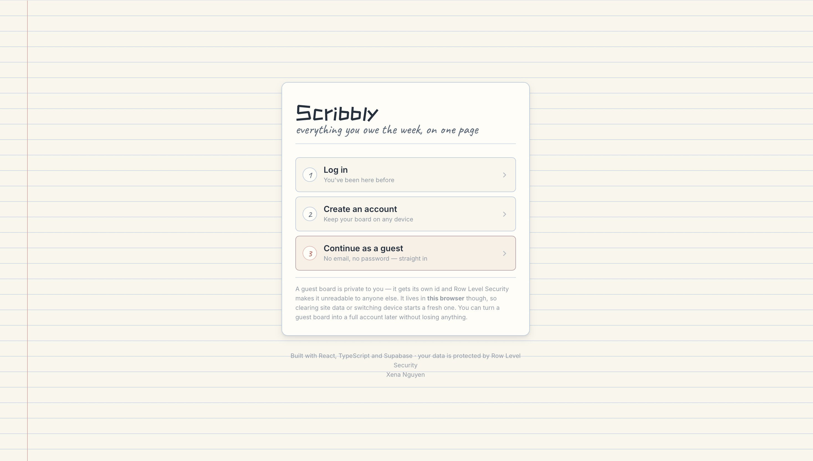

# Scribbly

A Kanban board themed by a classic paper notebook. 

Boards can be shared with other people. Everything persists in Supabase behind Row Level Security.

**Live demo:** [scribbly-gold.vercel.app](https://scribbly-gold.vercel.app)



---

## Design decisions beyond the brief

**I decided to pivot from one of the requirements -- the app doesn't open a guest session automatically for you.** The brief asks for a guest session on
first launch; instead the first screen offers three paths — start a guest session, create
an account, or log in. Opening a session silently means a visitor has an identity and a
board before they've chosen anything, and it leaves no natural place to explain what a
guest board actually is. Guest is still one click, and still the option the copy nudges
you toward.

**A guest board can become a real account without losing anything.** Linking an email to
an anonymous user keeps the same `auth.uid()`, so no data moves. See
[Authentication](#authentication).

**Boards are shareable.** Ownership moved from "one user per row" to a membership table, so
several people can work one board live, with owner / editor / viewer roles. Joining is by
secret link rather than by email invitation — the reasoning is in
[Shared boards](#shared-boards), and it's a security argument rather than a shortcut.

**Team members can't be invented.** An earlier version let you type a name and get an
assignable person who existed nowhere. Now a member row is created by a database trigger
when somebody actually joins, and a `CHECK` constraint stops any other kind existing.

---

## Quick start

```zsh
git clone https://github.com/xenanwen/Task-Board-Project.git
cd Task-Board-Project
npm install
cp .env.local.example .env.local   # then fill in the two values (see below)
npm run dev                        # http://localhost:5173
```

If `.env.local` is missing or incomplete the app renders a setup screen with these
same instructions instead of a blank page.

### Supabase setup (5 minutes)

1. Create a free project at [supabase.com](https://supabase.com).
2. **SQL Editor → New query** → run these **in this order**. Each is idempotent, so
   re-running any of them is safe — but the order matters, because each migration
   replaces policies and functions the previous one created:
   1. [`supabase/schema.sql`](supabase/schema.sql) — tables, RLS, grants, triggers
   2. [`supabase/002_collaboration.sql`](supabase/002_collaboration.sql) — shared
      boards, invite links, membership-based policies, and migration of any
      existing rows onto a board
   3. [`supabase/003_real_members.sql`](supabase/003_real_members.sql) — team
      members become real accounts: a trigger creates one when somebody joins, and
      hand-invented placeholder people are removed

   > Running `schema.sql` again **after** `002` would restore the old single-user
   > policies and break sharing. If you ever need to reset, run all three in order.

   Then confirm the result with [`supabase/verify.sql`](supabase/verify.sql) — a
   single query returning `PASS` / `FAIL` for RLS, grants, orphaned rows and
   board ownership.
3. **Authentication → Sign In / Providers**:
   - enable **Anonymous sign-ins** — without this there are no guest sessions
   - enable **Email**, and leave **Confirm email** on
4. **Authentication → URL Configuration → Site URL** → `http://localhost:5173`.
   Confirmation links redirect here, so add your production URL too once deployed.
5. **Project Settings → API Keys** → copy the **Project URL** and the **anon / publishable**
   key into `.env.local`:

   ```
   VITE_SUPABASE_URL=https://xxxxxxxx.supabase.co
   VITE_SUPABASE_ANON_KEY=sb_publishable_...
   ```

   The URL must be the bare origin — no `/rest/v1`, no trailing slash. supabase-js appends
   the API paths itself. (`src/lib/supabase.ts` strips a stray path and warns, because
   pasting one in is an easy mistake and the resulting failure is a bare network error.)

6. `npm run dev`.

> **Never** put the `service_role` key in `.env.local` or anywhere in `src/`. It bypasses
> Row Level Security, and anything prefixed `VITE_` is compiled into the public JS bundle.
> `src/lib/supabase.ts` throws at startup if it detects one.

---

## Scripts

| Command | What it does |
| --- | --- |
| `npm run dev` | Vite dev server with HMR |
| `npm run build` | Typecheck, then production build to `dist/` |
| `npm run preview` | Serve the production build locally |
| `npm run typecheck` | `tsc --noEmit` |
| `npm test` | 159 assertions over ordering maths, filters, dates, validation, invite links and board access |
| `npm run check` | typecheck + tests + build — run this before pushing |

---

## How it works

```
src/
├── lib/
│   ├── supabase.ts     Client, URL normalising, friendly error translation
│   ├── auth.ts         Guests, sign up / in / out, guest→account upgrade
│   ├── validate.ts     Email + password rules (pure, unit-tested)
│   ├── boards.ts       Boards, membership, invite links
│   ├── board.ts        Pure logic: ordering, filtering, urgency, stats
│   └── types.ts        Domain types, mirroring the SQL schema
├── hooks/
│   ├── useSession.ts   Who is signed in — driven by onAuthStateChange
│   ├── useBoards.ts    Which boards you can reach, and which is on screen
│   ├── useBoard.ts     One board: reads/writes, optimistic updates, realtime
│   └── useTaskThread.ts  Comments + activity for one task (lazy)
├── components/
│   ├── HomeScreen.tsx  Opening screen: log in / sign up / guest
│   ├── FinishUpgrade.tsx  Set a password after confirming an email
│   ├── BoardSwitcher.tsx  Your boards vs boards shared with you
│   ├── SharePanel.tsx  Invite links, roles, people with access
│   ├── Board.tsx       Drag-and-drop orchestration
│   ├── Column.tsx      One section + inline quick-add
│   ├── TaskCard.tsx    Card, with pointer/keyboard drag split
│   ├── TaskDetail.tsx  Detail drawer: fields, comments, timeline
│   ├── TaskComposer.tsx  Full new-task form
│   ├── TeamPanel.tsx   Members, labels, account / session
│   ├── Header.tsx      Stats ledger, search, filters, identity pill
│   ├── States.tsx      Loading / empty / error screens
│   └── Overlay.tsx     Modal + Drawer shells (focus trap, Escape)
└── styles/
    ├── tokens.css      Every colour, size and duration
    ├── base.css        Reset + the ruled-paper background
    ├── layout.css      Shell, masthead, board, columns
    ├── cards.css       Cards, chips, avatars, badges, skeletons
    ├── ui.css          Controls, overlays, timeline
    └── home.css        Opening screen, switcher, sharing, identity pill
```

### Authentication

Three ways in, all landing on the same security model. Every RLS policy keys on
`auth.uid()`, which is a real uuid whether you arrived as a guest or with a password —
**so adding accounts required no schema change at all.**

| Route | Mechanism | Reaches |
| --- | --- | --- |
| Continue as guest | `signInAnonymously()` | This browser only |
| Create an account | `signUp()`, email confirmation required | Any device |
| Log in | `signInWithPassword()` | Any device |

Routing is a state machine over the session rather than a router, because there are only
four screens: `booting` → skeleton, `signedOut` → home screen, `upgradePending` → set a
password, `signedIn` → the board.

Nothing sets auth state imperatively. Forms call into `lib/auth`, Supabase emits an event,
`useSession` picks it up via `onAuthStateChange`, and `App` re-renders. One direction, so
the UI can't disagree with the session — and the tokens that arrive in the URL when someone
returns from a confirmation email land on that same path for free, as do token refreshes
and signing out in another tab.

#### Turning a guest board into an account

A guest who has built up a board can keep it. Linking an email to an anonymous user
preserves the same `auth.uid()`, so every task, label, comment and activity row follows
with **no data migration** — nothing is copied or reassigned.

It has to be two steps, because Supabase refuses a password on an anonymous user until its
email is verified:

1. `updateUser({ email })` sends a confirmation link and sets `upgrade_pending` in user
   metadata. The password is *not* collected here, so there is nothing to store.
2. On return, `App` sees the flag and shows `FinishUpgrade`, which calls
   `updateUser({ password })` and clears it.

#### Why the implicit flow

`supabase.ts` sets `flowType: 'implicit'` deliberately. PKCE stores a code verifier in
localStorage and needs it back when the emailed link is opened — so confirming on your
phone an account you created on your laptop fails with "code verifier missing". Implicit
returns the tokens in the URL fragment instead, so confirmation works on any device. The
trade-off is tokens briefly appearing in the URL; for email confirmation that's the better
failure mode.

#### What deliberately does *not* exist

There is no "resume a past guest session by pasting its id". The guest uuid is not a
secret — it sits in every row and is printed in the Team panel — so treating it as a
credential would let anyone who saw one take over that board. Supabase agrees: an
anonymous user "can't access their account if they sign out, clear browsing data, or use
another device." Cross-device guest recovery would need a separate high-entropy code, and
minting one safely needs the `service_role` key in an Edge Function. Creating an account is
the supported path instead.

### Shared boards

A board has members. Ownership moved from "one user per row" to "one board per
row, with a membership table", so several people can work the same board live.

| Role | Read | Write | Share | Delete board |
| --- | --- | --- | --- | --- |
| owner | yes | yes | yes | yes |
| editor | yes | yes | no | no (can leave) |
| viewer | yes | **no** | no | no (can leave) |

#### Joining is by secret link, not by email

The Share panel mints a URL like `…/?invite=<token>`. Anyone signed in who opens
it joins the board; the token is stripped from the address bar immediately after.

That's a deliberate choice over emailing invitations, for two reasons:

1. **`auth.users` isn't readable from the browser**, and shouldn't be. Checking
   "does this email have an account?" needs `service_role` in an Edge Function,
   and any answer shown to the inviter is an **account-enumeration oracle** —
   it tells an attacker who is registered.
2. A link **works for people who haven't signed up yet**. An email lookup, by
   definition, cannot.

The token is 24 random bytes (~192 bits) generated by `gen_invite_token()` in
Postgres, never chosen by the client. Links default to a 14-day expiry, can be
capped by use count, and can be revoked. Every failure to redeem — wrong,
expired, revoked, exhausted — returns the *same* message, so a token can't be
probed for existence.

**Guests can join a shared board but can't create one to share.** A board owned
by an anonymous session that evaporates when the browser is cleared is a bad
thing to own, so `create_board_invite()` rejects anonymous callers by checking
the `is_anonymous` JWT claim. That finally gives the account-upgrade prompt a
concrete reason to exist.

#### Read-only means read-only

A viewer doesn't get an editable board that fails at the database. Drag sensors
are disabled, quick-add and the composer are gone, and the detail panel's fields
sit inside a `disabled` fieldset — one attribute rather than remembering to
disable twenty controls. RLS is still the actual boundary; the UI just stops
lying about what's possible.

#### Concurrency

`position` used to be last-write-wins, which is fine alone and wrong in company.
`moveTask` now guards its UPDATE with the `updated_at` it last read:

```ts
.eq('id', id).eq('updated_at', expected)
```

Zero rows back means a collaborator moved the same card first, so the board
reloads and says so rather than silently overwriting them.

### Data flow

The frontend talks to Supabase directly — there is no API server. Every mutation
is **optimistic**: React state updates first, the request goes out, and on failure the
exact pre-change snapshot is restored and a dismissible message appears. That is what
makes dragging feel instant.

A Postgres change feed filtered to `board_id=eq.<board>` keeps collaborators and other
tabs in sync. Realtime events trigger a debounced refetch, suppressed while our own writes
are in flight so they can't clobber an optimistic update mid-request. `tasks` and
`board_members` are the published tables; everything else loads when a panel opens.

### Card ordering: fractional indexing

Each task has a `position` float. Dropping a card between two others stores the
**midpoint** of their positions, so a drag writes exactly one row instead of
renumbering every card below it.

Floats run out of precision after ~50 consecutive splits between the same pair, so
`needsRebalance()` watches the gap and renumbers that column onto clean integers
before it becomes a problem. `npm test` asserts the guard fires with a >10-split
margin before positions could collide.

### Drag-and-drop

Built on [dnd-kit](https://dndkit.com). The subtle part is that a cross-column drag
has two phases:

- **`onDragOver`** writes a *draft* task list where the card already belongs to the
  new column at the hovered index, so the other cards part to make room.
- **`onDragEnd`** commits that draft's status and position verbatim.

Committing the draft rather than recomputing from the `over` element matters: the
draft has already inserted the card, which shifts every index the `over` element
reports, and recomputing lands the card one slot below its own preview. Same-column
reordering takes no draft at all — dnd-kit's sortable strategy handles the live
transforms, and the final index is derived with `arrayMove` on drop.

Pointer drag works from anywhere on a card. Keyboard drag works from the grip button
(Tab to it, Space, then arrows), which is kept separate so <kbd>Enter</kbd> can open
the task instead of starting a drag. Screen-reader announcements name the column and
the neighbouring card.

---

## Database

Ten tables, all with RLS enabled and forced. Base DDL in
[`supabase/schema.sql`](supabase/schema.sql), sharing in
[`supabase/002_collaboration.sql`](supabase/002_collaboration.sql), real members in
[`supabase/003_real_members.sql`](supabase/003_real_members.sql).

| Table | Purpose |
| --- | --- |
| `boards` | A board and its owner |
| `board_members` | Who may see or edit a board, and their role — the access-control table |
| `board_invites` | Secret join tokens, with expiry, use cap and revocation |
| `tasks` | board_id, title, description, status, priority, due_date, position, timestamps |
| `members` | Assignable people. Created by trigger when someone joins; always linked to a real account |
| `labels` | User-defined tags with colours, unique per board |
| `task_assignees` | Task ↔ member, many-to-many |
| `task_labels` | Task ↔ label, many-to-many |
| `comments` | Thread on a task, optional member as author |
| `activity` | Append-only history, written by triggers |

`user_id` survives on the content tables as **authorship** — who created the row — not as
ownership. That's what keeps comment and activity attribution meaningful once a board has
several people on it. Access is decided by `board_id` and `board_members`.

`status` and `priority` are `text` with `CHECK` constraints rather than Postgres enums —
same safety, but adding a value later is a one-line migration instead of `ALTER TYPE`.

The brief suggests a single `assignee_id` column; `task_assignees` is a superset of
that and satisfies the "assign one or more team members" bonus feature.

### Security model

Postgres access control has **two independent layers**, and a statement must pass both:

1. **`GRANT`** — may this role touch this table at all?
2. **`RLS`** — which rows may it touch?

Policies alone are not enough. Without a grant, PostgREST fails with
`42501 permission denied for table tasks` before any policy is even consulted. Section 4b of
the schema grants explicitly rather than relying on Supabase's default privileges, which
depend on which role ran the DDL.

`authenticated` gets full DML and RLS narrows it to its own rows. **`anon` is granted
nothing, deliberately** — a caller holding only the publishable key and no session should
not read a single row. Guests call `signInAnonymously()` first, which upgrades them to
`authenticated`. This is why hitting the REST API with just the anon key returns
`401 permission denied`: that is the model working, not a bug.

Access is decided by **board membership**, split by operation:

- **Read** — `USING (is_board_member(board_id))`, so any member including a viewer.
- **Write** — `WITH CHECK (can_edit_board(board_id))` on insert, and both clauses on
  update. Viewers fail here at the database, not merely in the UI.
- **Board itself** — rename and delete require `is_board_owner(id)`.

Details that matter:

- Those three helpers are **`SECURITY DEFINER`**, and they have to be. The policy *on*
  `board_members` needs to read `board_members`; through RLS that re-enters the same
  policy and Postgres raises *"infinite recursion detected in policy for relation
  board_members"*. A definer function reads with RLS bypassed and breaks the cycle. Each
  returns a single boolean about the calling user, so nothing leaks.
- Both `USING` and `WITH CHECK` are set on updates. `USING` alone would let you rewrite a
  row's `board_id` and move it to a board you happen to belong to.
- `board_id` on child rows (`comments`, `task_assignees`, `task_labels`) is overwritten by
  a **`BEFORE` trigger** that reads it off the parent task. Whatever the client sends is
  discarded, so a child row can't be filed under a different board than its parent.
- `activity` has **no** UPDATE or DELETE policy — history can't be rewritten through the
  API. Cascading deletes still clean up, because cascades run outside RLS.
- `board_invites` has **no read policy for non-owners**. Redemption goes through a
  `SECURITY DEFINER` RPC, so a token can't be probed for existence over REST.
- `(select auth.uid())` rather than bare `auth.uid()`, so Postgres evaluates it once per
  statement instead of once per row.
- Activity rows are written by `SECURITY DEFINER` triggers, so the log can't drift out of
  sync with the data even if the client forgets to write it.
- `members` carries `CHECK (auth_user_id is not null)` — invented people are impossible at
  the database level, not just absent from the UI.

### Verifying isolation

```sql
-- 1. RLS is on. Should return rowsecurity = true for all ten tables.
select tablename, rowsecurity from pg_tables
where schemaname = 'public' order by tablename;

-- 2. Grants are right: ten rows for `authenticated`, ZERO rows for `anon`.
select grantee, table_name,
       string_agg(privilege_type, ', ' order by privilege_type) as privs
from information_schema.role_table_grants
where table_schema = 'public' and grantee in ('anon', 'authenticated')
group by grantee, table_name order by grantee, table_name;
```

**From outside the app** — an unauthenticated caller with the publishable key must be
refused, not merely filtered:

```zsh
curl -sS -w "\nHTTP %{http_code}\n" \
  -H "apikey: $VITE_SUPABASE_ANON_KEY" \
  "$VITE_SUPABASE_URL/rest/v1/tasks?select=id&limit=1"
# → 401, permission denied for table tasks
```

Or just run [`supabase/verify.sql`](supabase/verify.sql), which returns both of those as
`PASS` / `FAIL` rows along with orphan and board-ownership checks.

**In the app** — open the board, note the id under **Team → This guest session**, add some
tasks. Open the same URL in a different browser or a private window: a new guest id, an
empty board, no trace of the first session's tasks. Log in as an account on both instead
and the same board appears in each. Share a link to a second account and both see the same
board, with a drag in one appearing in the other in well under a second.

---

## Features

**Required** — four columns, drag between them to change status, create tasks with
title/description/priority/due date, guest sign-in, RLS, distinct loading/empty/error
states, responsive layout.

**Accounts** — an opening screen offering log in, sign up, or a guest session; email
confirmation; sign out; and a guest→account upgrade that keeps the existing board.

**Sharing** — multiple boards per account with a switcher, invite links with roles,
expiry, use caps and revocation, a people-with-access list, and a genuinely read-only
viewer mode (drag sensors off, composer gone, detail fields in a `disabled` fieldset).

**Also built:**

- Team members with colour avatars — real accounts only, created when someone joins;
  multiple assignees per task, stacked on the card
- Task detail drawer with a comment thread
- Activity timeline — "Moved from To Do → In Progress · 2 hours ago", generated by DB triggers
- Custom labels, multiple per task, with board filtering
- Due-date badges that escalate: overdue (red) → today (amber) → within 2 days → later.
  Completed tasks keep the date but drop the alarm colouring
- Search across title and description, plus priority / assignee / label filters
- Header stats: total, done, overdue
- Keyboard shortcuts: <kbd>n</kbd> new task, <kbd>/</kbd> focus search, <kbd>Esc</kbd> close
- Inline quick-add per column that stays open for adding several in a row

---

## Design

The palette and type come from a physical notebook: cream stock (`#faf6ec`), faint blue
rules every 28px, a red margin line, ink-blue type. Column accents are borrowed from
ballpoint and highlighter colours rather than the usual SaaS blues.

Type is three faces with one job each — **ZCOOL KuaiLe** for display, **Inter** for UI
and for the column headings, **Caveat** for handwritten notes and empty states. ZCOOL
KuaiLe ships a single weight, so every display rule pins `font-weight: 400` and
`base.css` sets `font-synthesis-weight: none` — asking for a bold it doesn't have would
get a smeared synthetic one.

The ruled background uses `background-attachment: local`, so the lines scroll with the
content the way lines on a real page do. Columns are sunken and tinted; cards are
raised and lighter — that contrast, not borders, is what separates a section from
the cards inside it. Every colour and duration lives in `tokens.css`; no component
contains a raw hex value.

Responsive: four columns → two at 1080px → one full-width column per screen at 720px,
swiped horizontally with scroll snapping. `prefers-reduced-motion` disables animation.

---

## Deploying to Vercel

```zsh
npm run check      # typecheck + tests + build must pass
git push
```

Then at [vercel.com/new](https://vercel.com/new): import the repo, and Vercel will detect
Vite (`npm run build` → `dist`). Before the first deploy, add both environment
variables under **Settings → Environment Variables**:

- `VITE_SUPABASE_URL`
- `VITE_SUPABASE_ANON_KEY`

They must be set for the Production environment, and a redeploy is needed if you add
them after the first build — Vite inlines env vars at build time, not at runtime.

**One Supabase change is required**, because accounts use email confirmation. In
**Authentication → URL Configuration**, set **Site URL** to your Vercel URL and add it to
**Redirect URLs**. Otherwise confirmation links point at `localhost` and a reviewer clicking
one on the live site lands nowhere.

Nothing else needs configuring: the anon key works from any origin, and RLS is what
protects the data.

---

## Trade-offs

- **No backend.** The brief allows calling Supabase directly, and RLS makes a proxy
  redundant for this data model. A Go API would earn its place once there's work that
  can't be expressed as a policy — scheduled digests, webhooks, third-party calls.
- **Debounced refetch instead of merging realtime payloads.** Merging individual
  `postgres_changes` events into local state is fiddly and easy to get subtly wrong;
  a 400ms refetch is a few extra kilobytes and is always correct.
- **Two tables both called "member", for different jobs.** `board_members` is access
  control; `members` is who you can put on a card. They're kept in step by a trigger, so
  joining a board makes you assignable immediately. The cost is that you can no longer
  assign work to someone without an account — deliberate, since the alternative was a team
  list containing people who don't exist.
- **Collaboration is link-based, not email-based.** See the sharing section for why —
  briefly, an email lookup needs `service_role` server-side and leaks who has an account.
  Emailing the link is a thin layer on top of what's here, not a redesign.
- **Only `tasks` is published for realtime.** Comments, activity, members and labels load
  when a panel opens rather than streaming.
- **Implicit auth flow rather than PKCE**, so email confirmation works across devices. See
  the authentication section above.
- **Tests cover logic, not components.** The ordering maths, filters and validation are
  where the real bugs live, and they're pure functions — one of them caught a genuine
  off-by-one in cross-column drops. Component tests would need jsdom plus a testing library
  for comparatively little return.
- **One bundle, no code splitting.** ~111 kB gzipped for a two-screen app; splitting would
  add complexity for no perceptible gain.

---

## Licence

MIT
